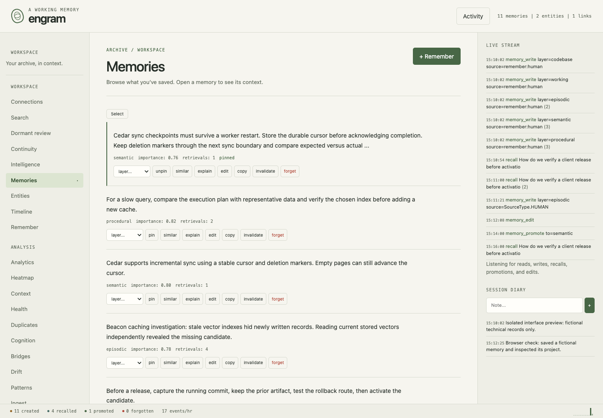

<p align="center">
  
</p>

# engram

memory for work that continues after the conversation ends.

[website](https://engram-memory.dev) · [documentation](https://engram-memory.dev/getting-started/quickstart/) · [0.7.0 changelog](docs/changelog.md)

i built engram to keep the things an agent should be able to return to: decisions,
errors, project context, procedures, and the connections between them. it stores
memories in sqlite or postgres, searches them through several retrieval signals,
and exposes the same store through a CLI, an MCP server, and a web workspace.

it also has a lifecycle. memories can be edited, challenged, superseded, promoted,
or forgotten. retrieving something is not proof that it is still true. keeping
that distinction visible matters more than making every query return an answer.

## what lives here

- **retrieval:** dense embeddings, full-text search, entity relationships, and
  associative retrieval, combined with intent-aware ranking and optional rerankers.
- **memory:** working, episodic, semantic, procedural, and codebase layers, with
  separate fact, procedure, and narrative types.
- **continuity:** session diaries, structured handoffs, recent context, decisions,
  error patterns, and explicit negative knowledge.
- **maintenance:** deduplication, consolidation, retention, entity graph tools,
  filesystem drift checks, and status history.
- **inspection:** a web dashboard, retrieval explanations, query comparisons,
  activity views, exports, and direct access to the underlying database.
- **dormant recall:** an optional shadow experiment that looks for a neglected
  relevant connection without putting it into ordinary answers.

some write and maintenance paths use an LLM for extraction, enrichment, or
consolidation. local embedding search can run without an LLM service. choosing an
API embedding or LLM backend sends the relevant inputs to that provider.

## what's new in 0.7.0

configuration is now checked before startup: misspelled fields, invalid values,
and missing explicit files fail clearly. every setting has an environment
override, and `engram config show` explains where its value came from while
redacting credentials. `config check` and `config schema` work without opening
storage or loading models.

retrieval explanations show the candidates that were returned **and rejected**,
including confidence cutoffs, ranking signals, and excerpt retries. inspection
does not reinforce memories or trigger dormant evaluations. the CLI, MCP,
native JSONL API and web workspace share the same explanation format.

the release also includes the BGE reranking fixes and fresh retrieval result
below, plus a new engraved mark and dark website.

## benchmarks

**100.0% session recall-any@5 (470/470)** on LongMemEval-S cleaned,
confirmed by a fresh full run on September 20, 2026. every embedding and
reranker score was recomputed; no saved inference scores were reused.
the run had **0 top-five misses**. rank-one recall was
439/470 (93.4%).

this is a development-set measurement: the dataset was also used for tuning.
the evaluation skips 30 abstention questions and disables the production
confidence cutoff. it measures whether at least one labelled answer session
appears in the first five results. generated-answer accuracy is not measured.
the measured retrieval candidate was published in commit `c3b8cea`, before the
configuration, explanation and website changes in 0.7.0. the linked evidence
retains that run's exact source hashes; this is not a second full benchmark of
the release package.

[method and limitations](docs/architecture/benchmarks.md) ·
[verified result and provenance](docs/assets/benchmarks/2026-09-20-fresh.json) ·
[question-level session rankings](docs/assets/benchmarks/2026-09-20-session-rankings.json)

### engram and other systems

these are reported figures with their actual metrics. external systems were
not rerun here, and their metrics, question sets and evaluation setups differ.
the table is a reference comparison, not a shared ranking.

| system | reported result | metric and evaluation scope |
| --- | ---: | --- |
| **Engram — September 20 retrieval candidate** | **100.0% (470/470)** | **session recall-any@5; fresh local run, 470 answerable questions** |
| Engram 0.6.2 — historical | 99.4% (467/470) | previously published session recall-any@5; not rerun here |
| [MemPalace — raw](https://github.com/MemPalace/mempalace/blob/develop/benchmarks/BENCHMARKS.md) | 96.6% | reported retrieval R@5; 500 evaluated questions in its report |
| [MemPalace — hybrid v4 + Haiku](https://github.com/MemPalace/mempalace/blob/develop/benchmarks/BENCHMARKS.md) | 100% | reported retrieval R@5 on 500 questions; explicitly tuned using failure cases |
| [EmergenceMem Internal](https://www.emergence.ai/blog/sota-on-longmemeval-with-rag) | 86.0% | reported answer accuracy on 500 LongMemEval-S questions |
| [Mem0 — new algorithm](https://mem0.ai/blog/mem0-the-token-efficient-memory-algorithm) | 94.4% | reported LongMemEval answer accuracy; evaluation count not stated in that report |
| dense RAG — OpenAI embeddings | — | no verified source for the earlier 68.4% figure; not measured in this run |
| BM25 baseline | — | no verified source for the earlier 58.2% figure; not measured in this run |

the previous table incorrectly put answer accuracy under an R@5 heading and
converted other systems' percentages into misses out of 470. those comparisons
have been removed. [LongMemEval's retrieval methodology](https://github.com/xiaowu0162/LongMemEval#memory-retrieval)
excludes the 30 abstention questions; QA evaluation measures a different task.

### by question type — fresh run

| question type | evaluated | hits in top 5 | R@5 | R@10 |
| --- | ---: | ---: | ---: | ---: |
| knowledge-update | 72 | 72 | 100.0% | 100.0% |
| multi-session | 121 | 121 | 100.0% | 100.0% |
| single-session-assistant | 56 | 56 | 100.0% | 100.0% |
| single-session-preference | 30 | 30 | 100.0% | 100.0% |
| single-session-user | 64 | 64 | 100.0% | 100.0% |
| temporal-reasoning | 127 | 127 | 100.0% | 100.0% |

run the same configuration locally on Apple Silicon:

```sh
python benchmarks/longmemeval/run_engram.py data/longmemeval_s_cleaned.json \
  --rerank --embedding-backend mlx --output fresh-results.jsonl
```

use a new output path for each run. the published evidence records dataset and
source hashes, model revisions, package versions, settings and all question IDs.

## get it running

python 3.11 or newer is required:

```sh
pip install engram-memory-system
engram --version
engram config check
engram config show
```

for the code in this checkout:

```sh
git clone https://github.com/raya-ac/engram.git
cd engram
python3 -m venv .venv
. .venv/bin/activate
pip install -e ".[dev]"
cp config.example.yaml config.yaml
```

the default embedding model is `BAAI/bge-small-en-v1.5`; the default reranker is
`BAAI/bge-reranker-base`. local models need to be
available on first use; subsequent runs can use their cached weights. the default
backend selects an available local implementation. set
`embedding_backend: sentence_transformers` for an explicit CPU setup.

check `config.yaml` before storing anything. it controls the database, models,
LLM backend, web binding, and optional experiments. the default write-time LLM
backend uses the Claude CLI; choose and configure a backend before using paths
that need extraction or enrichment.

```sh
engram --config config.yaml config check
engram --config config.yaml config show --json
engram config schema --json
engram --config config.yaml remember "the release requires a restore drill before activation"
engram --config config.yaml search "release preparation" -k 5 --json
engram --config config.yaml search "release preparation" --rerank --explain --json
```

`--config` comes before the command. without it, engram checks the current
working directory, the source checkout, then `~/.config/engram/config.yaml`.
every field supports an `ENGRAM_*` environment override, such as
`ENGRAM_RETRIEVAL_TOP_K=5`. environment values take precedence over the file;
see [configuration](docs/reference/config.md) and [the example](config.example.yaml).
`engram config show --defaults` inspects package defaults without reading local
files or environment overrides. existing configuration files are never rewritten.

## storage and models

sqlite is the default. it uses FTS5 and stores its database at
`~/.local/share/engram/memory.db`. postgres uses the same memory model with its own
full-text search and connection adapter.

```yaml
storage_backend: sqlite
db_path: ~/.local/share/engram/memory.db
embedding_backend: sentence_transformers
embedding_model: BAAI/bge-small-en-v1.5
embedding_dim: 384
cross_encoder_model: BAAI/bge-reranker-base
```

for postgres, set `storage_backend: postgres` and provide `ENGRAM_POSTGRES_DSN`
or a private `postgres_dsn` config value. keep credentials out of commits.
`engram migrate-postgres --help` describes the existing sqlite migration tool.
back up the source first and check its verification output before switching.

local embeddings and cross-encoder reranking are included in the base install.
`cross-encoder/ms-marco-MiniLM-L-6-v2` remains an optional local reranker. existing
config files keep their selected model; changing the package default does not
rewrite them.

optional extras provide the API clients:

```sh
pip install -e ".[voyage]"
pip install -e ".[openai]"
pip install -e ".[gemini]"
pip install -e ".[api]"
```

model selection determines the embedding backend for recognized API models.
configure the corresponding provider key in the process environment. changing
embedding models requires compatible dimensions and re-embedding existing data;
use `engram reembed --dry-run` before `engram reembed`.

## use it from an agent

start a stdio MCP server:

```sh
engram --config /absolute/path/to/config.yaml serve --mcp
```

an MCP client can launch it with an explicit executable and config:

```json
{
  "mcpServers": {
    "engram": {
      "command": "/absolute/path/to/engram/.venv/bin/engram",
      "args": ["--config", "/absolute/path/to/config.yaml", "serve", "--mcp"]
    }
  }
}
```

use `recall_recent` for chronology and `recall_hints` for lightweight recognition.
use `recall` for a concrete semantic query. `remember`, `remember_decision`, and
`remember_error` store context; `session_handoff` and `resume_context` support
resuming work. tools also cover entities, timelines, memory status, codebase
scanning, drift, and consolidation. the server's `tools/list` is the current
interface; [mcp_server.py](engram/mcp_server.py) defines it.

`recall` supports `facts_only`, `facts_plus_rules`, and `full_context` profiles.
ordinary search records returned results as accesses. that is a retrieval signal,
not explicit evidence that someone used the result.
use `recall_explain` to inspect retrieval without recording those accesses, or
`config_show` to inspect redacted effective settings. rejected candidates remain
visible even when no memory passes the confidence gate; forgotten, inactive and
profile-filtered memory content stays hidden.

## native application integration

`engram --config /absolute/config.yaml api` runs a persistent local JSONL
process. it exposes project context, semantic search, session checkpoints and
structured evidence through a supported service boundary. a harness can launch
Engram in its own Python environment without importing the store or speaking MCP.

Kiln's native experience and Mythic's check/planning lifecycle belong to those
projects. Engram supplies reusable memory and evidence APIs. evidence records
carry caller provenance, timestamps, expiry and source references; they are not
independently verified merely because they were stored. referenced forgotten or
inactive memories cannot remain eligible supporting evidence. no observation
can instruct Engram to execute a command or fetch a URL.

[the native API contract](docs/native-api.md) distinguishes nonreinforcing scoped
context from ordinary semantic search, which records accesses. it also describes
immutable evidence, explicit unknown/stale states and supported operations.

## optional Codex compatibility

the optional separate adapter exposes `codex_context`, `codex_checkpoint`,
`codex_diagnostics`, and a scoped `codex_evidence` reader. it reads explicitly scoped active
memories, saves a deliberate task handoff, and reports its own process and
persisted index coverage. it doesn't alter core retrieval, collect transcripts,
install hooks, or reinforce memories when context is read.

```sh
engram --config /absolute/engram/config.yaml codex setup --project /absolute/project
```

that prints a supported `codex mcp add` command for review; it does not register
anything automatically. each adapter process is bound to one canonical project
directory. unscoped legacy notes and sibling projects stay outside its context.
checkpoints are separate from memory records and can be replaced or cleared.
the full Engram MCP server can remain connected alongside it for broader recall.

[adapter setup, task-start/resume workflow and limits](docs/codex-adapter.md)
includes tested registration syntax and explains what diagnostics can establish.
a fresh adapter's PID does not prove another running client has reloaded code.

## how retrieval works

```text
query → intent and query features
      → dense + full-text + entity graph + associative candidates
      → reciprocal rank fusion
      → date, importance, recency and access boosts
      → optional cross-encoder with confidence gate and prior coverage
      → optional trained deep reranker
      → noise only when cross-encoder is off → ordinary results

original query → optional independent dormant search → separate shadow log
```

the ANN index accelerates dense retrieval when available; a brute-force embedding
path remains available. the CLI makes cross-encoder reranking opt-in with
`--rerank`; MCP recall uses it. the deep reranker runs when a trained model is
available. debug output explains the ordinary ranking stages.

`retrieval.rerank_passage_fallback` is enabled by default for local rerankers.
when every full-document score, after sigmoid, is below `rerank_passage_floor`
(default 0.001), it can retry one excerpt of up to 160 words from each long
document with matching query terms. it keeps the larger full-document or
excerpt logit and uses the same semantic query for both calls. short documents,
documents without a lexical match, and hosted rerankers keep their original
scores. set `rerank_passage_fallback: false` to disable the retry.

excerpt matching includes conservative regular English singular/plural forms;
each distinct original query term counts once per sentence. the activation
floor was selected during development on LongMemEval. results on that dataset
are development measurements, not held-out accuracy, and the floor is not a
calibrated probability.

the retry adds model work and can leave useful context outside the excerpt.
the independent `min_confidence` gate (default 0.6) applies after scoring adjustments and
can reject a result whose benchmark rank improved. [retrieval internals](docs/architecture/retrieval.md#focused-excerpt-retry)
describe selection, date handling and score traces.

ranking scores depend on the stage and model. a cosine score, a cross-encoder
score, and a fused ranking score are not interchangeable confidence estimates.
local cross-encoder logits pass through a sigmoid once; hosted rerankers keep
their normalized score scale. resolved temporal evidence is applied in logit
space. `retrieval.rerank_fusion_alpha` optionally blends the resulting score with
the pre-rerank reciprocal rank, with a value between 0 and 1; its default is 0.
reranked scores stay between 0 and 1, without additional lexical bonuses or
random noise. searches with reranking off retain the small random noise term.

`retrieval.preserve_prior_candidate` is enabled by default. after the confidence
gate, a request for at least two results keeps the best eligible hybrid
candidate in the requested result count. if it is missing, the coverage step
moves it into the last requested position while retaining the rerank winner.
this changes selection order without changing score values, including when
`rerank_fusion_alpha` is 0. consumers should keep the returned order rather than
sort it again by score. set `preserve_prior_candidate: false` to disable coverage.

changing the fusion weight, minimum confidence, coverage setting, passage
fallback flag or activation floor uses a separate rerank cache entry. the production search and
benchmark share date parsing and relative time helpers. search preserves the user's spelling;
configured query expansion still applies.

## dormant recall

sometimes an old project stopped because a capability did not exist yet. later,
a new capability appears, but ordinary retrieval keeps returning the recent,
often-used material. dormant recall asks whether a neglected memory is relevant
to the task now.

this is an experiment. it is **off by default**. enabling shadow mode evaluates
at most one candidate per hybrid search, or none, and writes the result separately.
it does not add suggestions to recall output, hints, context, or normal answers.
there is no automatic visible mode in this version.

```yaml
dormant_recall:
  mode: shadow                 # use "off" to disable; quote it in YAML
  candidate_limit: 50
  dormancy_days: 30
  min_relevance: 0.75
  max_bonus: 0.05
  rerank_candidates: 12
  min_rerank_score: 0.6
  cooldown_days: 7
  feedback_cooldown_days: 30
  log_max_events: 1000
  log_retention_days: 30
```

the candidate search reads current active, dormant embeddings directly from the
database, independently of ordinary results and the ANN cache. a stale index
cannot hide a newer memory from this path. candidates must pass the cosine floor
and a separate query/content relevance check. a bounded
bonus from dormancy and existing importance can reorder close relevant matches;
age cannot bring an irrelevant item through the gate. literal word overlap is
supporting evidence, not a requirement, so differently worded connections can
still qualify. the explanation reports the evidence without inventing a story
about why an old problem is now solved.

only active, non-forgotten memories qualify, with the same memory-type profile
as the search. forgotten, archived, deleted, superseded, merged, or otherwise
inactive memories are excluded. the current forgotten flag covers both lifecycle
archival and explicit forgetting; this experiment does not try to separate them.

review it explicitly:

```sh
engram --config config.yaml dormant review --limit 20
engram --config config.yaml dormant inspect EVENT_ID
engram --config config.yaml dormant feedback EVENT_ID useful
```

`review` lists metadata. `inspect` fetches the eligible candidate and records a
separate exposure timestamp. feedback is `useful`, `irrelevant`, or `dismissed`;
`useful` means the connection was actually used. MCP provides `dormant_review`,
`dormant_inspect`, and `dormant_feedback` for the same workflow.

computing, inspecting, or giving feedback on a candidate never increments its
ordinary access count, updates its ordinary last-accessed time, or changes its
importance. silence does not mean useful. cooldown and explicit-use state survive
log rotation. the bounded log stores IDs, times, numeric signals, and feedback,
without copying query text, matching words, or memory content.

set `ENGRAM_DORMANT_RECALL_MODE=off` to override the file at process start.
existing MCP processes do not hot-reload these edits. the feature creates only
additive experiment tables and contains its failures so normal recall can finish.
see [the dormant recall guide](docs/dormant-recall.md) for ranking, persistence,
retention, and feedback details.

**what is verified:** isolated SQLite and PostgreSQL tests cover eligibility,
independent candidates, bounded ranking effects, cooldown, feedback, persistence,
concurrency, failure isolation, and absence of reinforcement. a separate CLI/MCP
smoke test uses synthetic memories and the cached local embedding model.

**what remains unproven:** usefulness in real work and threshold calibration.
in the initial cosine-only probe, a sentence with no literal query overlap scored
about 0.734. the 0.75 default abstained; a lower diagnostic threshold admitted it.
the added relevance check now rejects that thin sentence. the current interface
smoke test uses a more informative prototype note, which still falls below 0.75
and is admitted only in its separately labelled 0.70 isolated pilot. that is a
concrete precision/recall tradeoff, not evidence of broad usefulness.

the repair also recovered a real Junkstep release note with one previous access
and about 37 days of dormancy. it was missing from the old ANN index but ranked
first against current database vectors at 0.817. in an isolated snapshot it added
installer-packaging and release-verification context missing from ordinary
results, passed the relevance check, and remained unreinforced. this is a targeted
evaluator assessment; no positive user feedback was fabricated. exact scanning
trades additional database work for current coverage, so larger stores need
measurement before treating this as a scaling solution.

## keep the store understandable

```sh
engram ingest /path/to/notes/
engram entity "project name" --graph
engram drift --json
engram patterns --dry-run
engram index status
engram export memories.json --include-embeddings
engram import memories.json --skip-duplicates
engram consolidate
```

consolidation can cluster, summarize, promote, and soft-archive memories. drift
checks compare stored filesystem references with current files; `drift --fix`
changes memory state. inspect these operations before using them on a valued
store. they are maintenance actions, not substitutes for validating a claim.

the portable export includes active memories. it is not a lossless backup of
forgotten records, all history, or the dormant experiment tables. use native
sqlite or postgres backup tooling when you need the full store, and verify a
restore into an isolated database. the legacy sqlite-to-postgres migration does
not yet transfer dormant telemetry or its cooldown state.

## inspect it in the browser

```sh
engram --config config.yaml serve --web
```

the workspace binds to `127.0.0.1:8420` by default. its redesigned memory list,
navigation and inspector share a restrained archive layout. all eighteen original
views remain available, alongside dormant review. mobile Menu and Activity
drawers retain navigation and inspection; `/` focuses search, and view URLs can
be bookmarked. memory editing loads the full record rather than the list excerpt.

[web workspace controls](docs/guides/web-workspace.md) cover search, hints,
filters, continuity, graph and maintenance workflows. `web.auth_token`
configures bearer authentication. keep the database and config private, and
check authentication and network exposure before making the service reachable
outside the local machine. `serve --mcp-sse` is also available for HTTP MCP use.

## development and checks

```sh
python -m pytest tests/ -q
```

the ordinary suite expects cached local embedding weights; the shared fixtures
set Hugging Face offline mode. dormant contract tests use temporary sqlite files.
set `ENGRAM_TEST_POSTGRES_DSN` to a disposable test cluster to also run their
postgres cases; each creates and drops its own randomly named schema.

```sh
python -m pytest tests/test_dormant.py -q
python tests/dormant_smoke.py --work-dir /path/to/new/disposable/directory
```

the smoke test starts fresh CLI and stdio MCP processes against synthetic sqlite
stores. it compares ordinary result IDs with the experiment off and on, exercises
review/inspection/feedback, checks cooldown, and reads back access and importance
fields. it writes a JSON report in the supplied directory. it does not open a
production config or restart an existing service.

[config](engram/config.py), [store](engram/store.py),
[retrieval](engram/retrieval.py), [dormant recall](engram/dormant.py),
[lifecycle](engram/lifecycle.py), and [the MCP server](engram/mcp_server.py) are the
main entry points; the [native service](engram/service.py) is the application
boundary and [the optional Codex adapter](engram/adapters/codex.py) is a separate
integration layer. further guides and reference material live in [docs](docs/).

## license

[Engram Public Use License 1.0](LICENSE).


