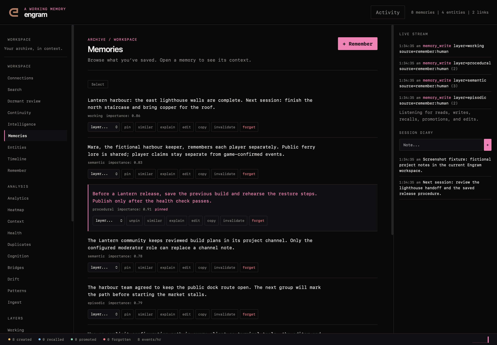
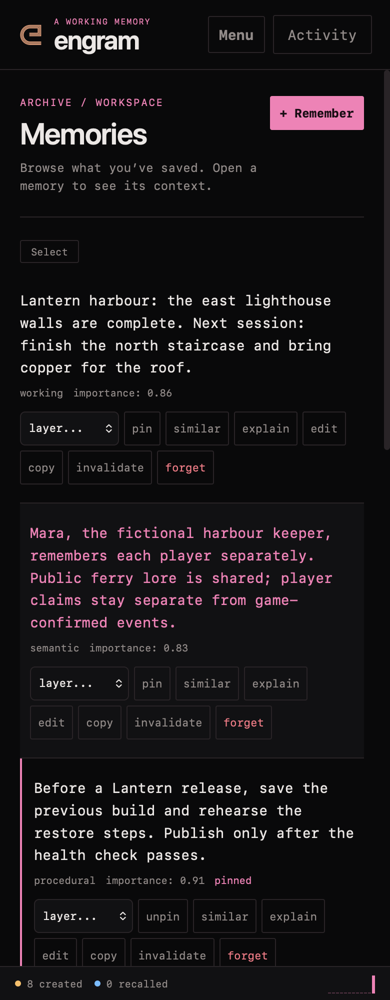

# web workspace

The web workspace presents the same Engram store through a memory list, search,
connected context and maintenance tools. Start it with an explicit configuration:

```sh
engram --config /absolute/path/to/config.yaml serve --web
```

The default address is `http://127.0.0.1:8420`. Existing `web.auth_token` protection
continues to apply to the workspace and API; keep it configured when required.
The redesign does not add demo memories or replace authentication rules. Existing
database initialization and migrations still apply when starting the server.

## navigate and inspect

The initial view is Memories. The sidebar keeps all existing tools available:
Search, Continuity, Intelligence, Memories, Entities, Timeline, Remember, Neural
Map, Analytics, Heatmap, Context, Health, Dedup, Cognition, Bridges, Drift,
Patterns and Ingest. Dormant review is a separate nineteenth view.

At narrow widths, Menu opens navigation and Activity opens the context drawer.
The inspector and diary remain reachable. Press `/` to focus search and Escape to
close an open drawer. View URLs use hashes so a specific workspace view can be
bookmarked without changing API routes.

Memory rows open the inspector. Existing editing, annotations, pinning, lifecycle
actions, similarity and importance details remain available. The editor loads the
full memory rather than saving the abbreviated list excerpt. Selection and bulk
actions, layer browsing and export remain part of the workspace.

## search and continuity

Search retains layer/importance filters, hints and retrieval explanations.
Ordinary search keeps its existing access accounting. A search result is not a
claim that an old note is still current; inspect its source and timestamp.

Continuity displays stored handoffs. Intelligence can build a focused brief,
compare queries and show recent activity. The
[native API](../native-api.md) provides stricter project-bound context for
application workflows; the generic workspace keeps its existing store-wide scope.

## review a dormant connection

Dormant review lists metadata without fetching candidate contents automatically.
Open a connection explicitly to inspect the eligible memory. Then choose Useful,
Irrelevant or Dismissed only when that describes what happened. Useful means the
connection was actually used, not merely that a model judged it plausible.

Opening or giving feedback does not change ordinary access count, last-accessed
time or importance. An inactive or forgotten candidate cannot be opened through
this review flow. See [the experiment guide](../dormant-recall.md) for its mode,
retention and cooldown behavior.

## maintenance remains explicit

The graph, entity tools, timeline, charts and retention controls retain their
existing functions. Operations such as consolidation, deduplication, ingestion,
training and drift fixes can change the store. Read their results and existing
confirmation prompts; a visual redesign does not make those operations read-only.

The design uses local system typography and no external font or unused UI-script
CDN. Responsive navigation, restrained view transitions and visible keyboard
focus are shared across the workspace. Validation uses an isolated representative
store; no synthetic records are added to a live installation.

## the workspace



*the current dark workspace on desktop, using fictional verification data.*



*the current dark workspace on mobile, using fictional verification data.*
